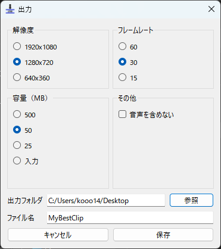
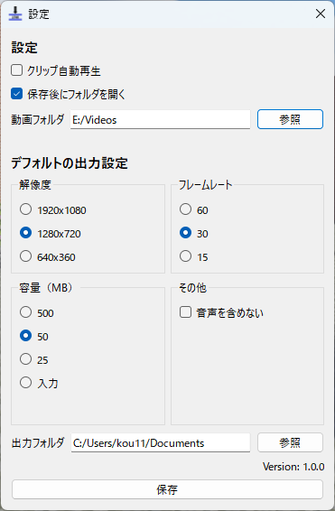

# To25 v1.0
To25へようこそ！
To25はDiscord向けのクリップ作成ソフトウェアです。

# ダウンロード
対応OS: Windows10, Windows11

インストーラー版（通常はこちら）：準備中

ソースコードから実行：[こちらを参考](#ソースコードから実行する方法)

# 使い方
## メイン画面
To25.exeをダブルクリックしてソフトウェアを起動します。

起動すると最近の録画ファイルの自動再生、または動画選択画面が表示されます。

**!! 初回起動時には初期設定を行ってください。「動画ファイル」の場所にインスタントリプレイの保存場所を正しく指定しない場合、クリップの自動再生機能が使用できません。!!**


### 1．シークバー

赤い先が動画の再生位置、青い範囲がトリミング（カット）する範囲を表しています。

シークバーの範囲でマウスホイールを回転させると1秒、右クリックを押しながら回転させると5秒ずつスキップできます。

### 2．操作パネル

左から
* トリミング開始地点の指定（s）
* 10秒戻る（右矢印）
* 再生と一時停止（スペース）
* 10秒進む（右矢印）
* トリミング終了地点の指定（e）

の操作が可能です（カッコ内はショートカット）

### 3．保存ボタン
動画の保存画面を表示します。Ctrl+Sでも保存できます。

### 4．メニューバー
以下の操作が可能です。
- ファイル
    - 開く（o）
    - 保存
    - 終了
- 編集
    - トリミング範囲内でリピート
    - 設定
- ヘルプ
    - 本ページを表示します

## 保存画面


### 解像度
動画の解像度を指定します。解像度が高いほど容量は大きくなります。

### フレームレート
フレームレートを指定します。フレームレートが高いほど容量は大きくなります。

### 容量
出力容量を指定します。最終的な容量は誤差を含む場合があります。

Discordの無料ユーザーは25MB、Discord Nitro Basicユーザーは50MB、Discord Nitroユーザーは500MBを選択してください（2024/6/10現在）。任意の容量を指定することも出来ます。

### その他
* 動画に音声を含めない場合はオンにしてください。

### 出力フォルダ
動画の出力先のフォルダを指定します。

### ファイル名
ファイル名を指定します。拡張子の指定は必要ありません（自動で.mp4で保存されます）。


# 設定
左上のメニューバーの編集→設定より開くことが出来ます。



### クリップ自動再生
動画フォルダに指定されているファイルの中から、最新かつ6時間以内に保存された動画を起動時に自動再生します。ファイルは指定したフォルダから5階層まで検索されます。フォルダ内に大量のファイルがある場合、起動に時間がかかる事があります。その場合はオフにしてください。

### 保存後にフォルダを開く
動画の保存時に出力先のフォルダを開くかを選びます

### 動画フォルダ
インスタントリプレイが保存されるフォルダを指定してください。フォルダはGeforce Experience→設定→録画→ビデオより確認可能です。

クリップ自動再生と動画を開く際のデフォルトのフォルダに使用されます。

### デフォルトの出力設定
デフォルトの出力設定を指定します。

# バグ報告
GitHubのIssuesより報告をお願いします。または、[X(@ci18kawaguchi)](https://x.com/ci18kawaguchi)のDMまでお願いします。

# ソースコードから実行する方法
## GitHubよりソースコードをダウンロード

```
git clone https://github.com/kooo14/To25.git
```
またはCode→Download ZIPよりダウンロード後、解凍
## Pythonをインストール
推奨環境はPython 3.8.0です。

ダウンロードは[こちら](https://www.python.org/ftp/python/3.8.0/python-3.8.0-amd64.exe)

## 起動スクリプトを実行
ダウンロードしたTo25フォルダ内のrun.batを実行してください。

仮想環境の作成とライブラリのインストールが自動で行われます。

# 更新履歴
* v1.0 初期リリース (2024/6/10 )
